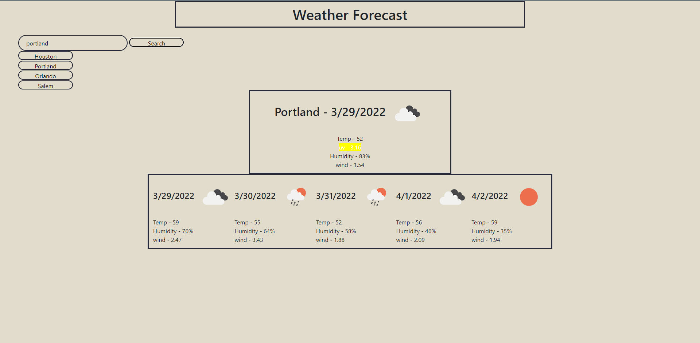

# WeatherApp

## User Story

`AS A traveler
I WANT to see the weather outlook for multiple cities
SO THAT I can plan a trip accordingly`
## Description
This simple weather app uses a weather API to make it easy for anybody to look up the weather in certain areas. 
## Installation

This project is very simple and does not require any dependencies. Simply git clone and start within a local server.
    
## License

[MIT](https://choosealicense.com/licenses/mit/)

## Screenshots

## Feedback

If you have any feedback, please reach out to me on twitter @Dennnyboyy
